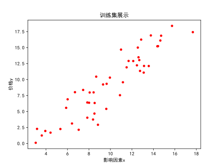
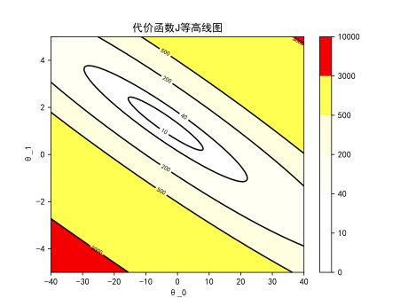
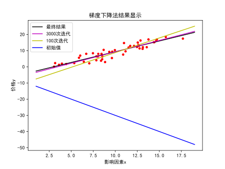
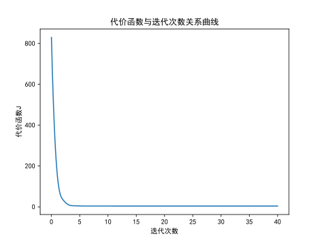

# 线性回归

回归问题属于__监督学习算法__。

回归问题用于预测一个具体的数值输出（比如房价）<font color=blue>（与之相对应的是分类问题，用于预测离散输出）</font>

[toc]

## 以房价预测问题为例

### 前置内容

线性回归问题中都有一个数据集，称为__训练集__。

>课程符号小记：
>
>* $m$训练集中训练样本数目
>* $(x,y)$表示单个__训练样本__
>* $(x^{(i)},y^{(i)})$表示第$i$个训练样本

对单变量线性回归，假设函数$h_\theta(x)=\theta_0+\theta_1 x$（$\theta_i$称为__模型参数__）

---

### 如何选择模型参数？

应当选择合适的模型参数，使得在训练集中给出的$x$值要能比较准确预估$y$的输出值

于是引入__代价函数__的概念，用于衡量这个预估的准确程度

具体到单变量线性回归问题，则代价函数为
$$
J(\theta_0,\theta_1)=\frac{1}{2m}\sum_{i=1}^m(h_\theta(x^{(i)})-y^{(i)})^2
$$
它反映了样本与假设函数预估的平均误差，要寻找一个组合$(\theta_0,\theta_1)$使得代价函数的值最小。

---

## 梯度下降法

梯度下降法是一类常用的将代价函数$J$最小化的方法。

首先先列出我们的所处情景：

>前置条件：
>
>- [x] 有一个代价函数$J(\theta_0,\theta_1)$。（当然也可以有更多的参数，这里以线性回归为例子）
>- [ ] 需要得到最小化代价函数$J(\theta_0,\theta_1)$的参数组合$(\theta_0,\theta_1)$。
>
>给出的解决方案：
>
>- [ ] 给定一组初始的$(\theta_0,\theta_1)$（比如$(0,0)$）
>- [ ] 不断变更$(\theta_0,\theta_1)$来缩小代价函数$J$的值，直到$J$降低至最小值（局部最小值）为止。

于是给出梯度下降法的数学定义：

不断重复下述过程，直到结果收敛：
$$
\begin{align}
\theta_j:=\theta_j-\alpha\frac{\partial}{\partial\theta_j}J&&(对全体j)
\end{align}
$$
其中$\alpha$被称为学习率，它决定了我们每次梯度下降的步长与梯度下降收敛的速度。

另一个值得注意的事情是上述计算时同步进行的，也就是说大概是下面这个工作流程：

$$
\begin{align}
a_0=\theta_0-\alpha\frac{\partial}{\partial\theta_0}J\\
a_1=\theta_1-\alpha\frac{\partial}{\partial\theta_1}J
\end{align}
\quad\Longrightarrow\quad
\begin{matrix}
\theta_0=a_0\\
\theta_1=a_1
\end{matrix}
$$

而不是：

$$
\begin{matrix}
a_0=\theta_0-\alpha\frac{\partial}{\partial\theta_0}J\\
\theta_0=a_0
\end{matrix}
\quad\Longrightarrow\quad
\begin{matrix}
a_1=\theta_1-\alpha\frac{\partial}{\partial\theta_1}J\\
\theta_1=a_1
\end{matrix}
$$
对下面这个运算，其内容已经不能算是梯度下降法，而是某种有一定差别的新算法。

---

## 问题实践

具体到本问题，根据梯度下降法原理，可以得到：
$$
\begin{align}
&J(\theta_0,\theta_1)=\frac{1}{2m}\sum_{i=1}^m(h_\theta(x^{(i)})-y^{(i)})^2\\
\Longrightarrow&j=0:\frac{\partial J}{\partial\theta_0}=
\frac{1}{m}\sum_{i=1}^m(h_\theta(x^{(i)})-y^{(i)})
\\
\Longrightarrow&j=1:\frac{\partial J}{\partial\theta_0}=
\frac{1}{m}\sum_{i=1}^m(h_\theta(x^{(i)})-y^{(i)})x^{(i)}
\end{align}
$$
导入所需要的包：

```python
import numpy as np
import matplotlib.pyplot as plt
from functools import partial
import matplotlib as mpl
from time import time
```

先使用<font color=orange>`Python`</font>生成一个随机的数据集作为使用的训练集：

```python
np.random.seed(10)
price = [0.36 * i + 2 * np.random.random() - 1 for i in range(2, 50)]
num = [0.24 * i + 5 * np.random.random() + 1.5 for i in range(2, 50)]
```

定义代价函数<font color=orange>`J`</font>，两个偏导数<font color=orange>`dJ0`</font>，<font color=orange>`dJ1`</font>，梯度下降法的函数<font color=orange>`loop`</font>：

```python
# 定义代价函数J
def J_fun(t_0, t_1, _x_data, _y_data):
    # 若数据维度不同则报错
    if len(_x_data) != len(_y_data):
        raise ValueError('The dimension of X_data is different from that of Y_data')
    _result = 0
    for _i in range(len(_x_data)):
        _result += ((t_0 + t_1 * _x_data[_i]) - _y_data[_i])**2
    _result *= 1 / (2 * len(_x_data))
    return _result


# 定义梯度下降法用的两个迭代函数J_0与J_1与迭代过程loop
def J0_fun(t_0, t_1, _x_data, _y_data):
    # 若数据维度不同则报错
    if len(_x_data) != len(_y_data):
        raise ValueError('The dimension of X_data is different from that of Y_data')
    _result = 0
    for _i in range(len(_x_data)):
        _result += (t_0 + t_1 * _x_data[_i]) - _y_data[_i]
    _result *= 1 / len(_x_data)
    return _result


def J1_fun(t_0, t_1, _x_data, _y_data):
    # 若数据维度不同则报错
    if len(_x_data) != len(_y_data):
        raise ValueError('The dimension of X_data is different from that of Y_data')
    _result = 0
    for _i in range(len(_x_data)):
        _result += _x_data[_i] * ((t_0 + t_1 * _x_data[_i]) - _y_data[_i])
    _result *= 1 / len(_x_data)
    return _result


def loop_fun(t_0, t_1, alpha=0.001, j_list=()):
    # 检查是否传入J偏导函数
    for i in j_list:
        if not callable(i):
            raise ValueError('Please input J-function')
        if len(j_list) != 2:
            raise ValueError('Please input two J-function')
    _J0 = j_list[0]
    _J1 = j_list[1]
    _t0 = t_0 - alpha * _J0(t_0, t_1)
    _t1 = t_1 - alpha * _J1(t_0, t_1)
    return _t0, _t1
```

训练集绘图可以得到：

```python
plt.scatter(num, price, c='r', s=15)
plt.xlabel('影响因素x')
plt.ylabel('价格y')
plt.title('训练集展示')
plt.show()
```

其中代价函数$J$可绘制等高线图有：

```python
x, y = np.linspace(-40, 40, 1000), np.linspace(-5, 5, 1000)
X, Y = np.meshgrid(x, y)
Z = J(X, Y)
cground = plt.contourf(X, Y, Z, [0, 10, 40, 200, 500, 3000, 10000], cmap='hot_r')
cline = plt.contour(X, Y, Z, [10, 40, 200, 500, 3000], colors='k')
plt.clabel(cline, fontsize=7)
plt.colorbar(cground)
plt.title('代价函数J等高线图')
plt.xlabel('θ_0')
plt.ylabel('θ_1')
plt.show()
```

 

做迭代，取两次迭代结果间距离小于$0.0001$为迭代结束标志，取学习率$\alpha=0.005$，记录迭代中间的点：

```python
t0, t1 = -10, -2        # 迭代起点
t0_list = [t0]          # 记录集合
t1_list = [t1]
t0l, t1l = 0, 0         # 迭代中间量
t_start = time()
while (t0-t0l)**2+(t1-t1l)**2 > 0.00000001:
    t0l, t1l = t0, t1
    t0, t1 = loop(t0, t1, alpha=0.005)
    t0_list.append(t0)
    t1_list.append(t1)
t_end = time()
```

以代价函数等高图为背景绘制迭代过程，其中紫色为起始点，颜色越靠近黄色则表明迭代次数越多：

```python
# 在代价函数J等高线图上显示迭代的过程
x, y = np.linspace(-40, 40, 1000), np.linspace(-5, 5, 1000)
X, Y = np.meshgrid(x, y)
Z = J(X, Y)
cground = plt.contourf(X, Y, Z, [0, 10, 40, 200, 500, 3000, 10000], cmap='hot_r')
cline = plt.contour(X, Y, Z, [10, 40, 200, 500, 3000], colors='k')
plt.clabel(cline, fontsize=7)
plt.colorbar(cground)
plt.xlabel('θ_0')
plt.ylabel('θ_1')
plt.title('迭代过程可视化')
plt.scatter(t0_list, t1_list, s=3, c=np.arange(len(t0_list))/len(t0_list))
plt.show()
```


可以看到，确实在沿梯度逐渐向最小值点逼近。

以训练集散点图为背景距离展示训练成果：



前四十次迭代对$J$的下降效果如下：



打印报告：

> 迭代次数:6215
> 用时:0.08706855773925781s
> 迭代最终解: θ0 = -3.911718630560111
>           		      θ1 = 1.3258434747469556

具体内容见python文件夹中的文件<font color=orange>`Machine_Learning_L2.py`</font>文件。
