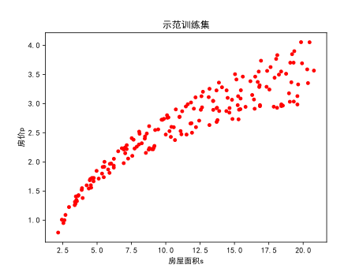
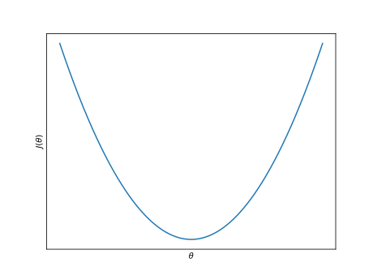

# 多元线性回归

在[Lesson 2](..\md\机器学习 L2 线性回归.md)中我们讨论了对单个因素对房价的影响问题的学习模型，但是在现实生活中，任何事物受到影响都是多要素的。房价可能同时受到房屋面积，卧室数量，房子地段等因素的综合影响，这种情况下讨论__多个因素__影响下的回归模型建立与实现。

[toc]

## 以房价问题为例

### 前置内容

假设我们现在有这么一个训练集：

| 房屋大小$m^{2}$ | 卧室数目 | 楼层位置 | 房屋年龄 | 价格$\times 10^{3}\$$ |
| ---  | ---  | ---  | ---  | ---  |
|2104|5|1|45|460|
|1416|3|2|40|232|
|1534|3|2|30|315|
|852|2|1|36|178|
|...|...|...|...|...|

依旧先介绍符号记法：

- $x_1$，$x_2$，$x_3$，....表示各个特征。
- $y$表示被预测值（也就是房价）。
- $n$表示特征的数目（例如上面就有$n=4$）。
- $x^{(i)}$表示第$i$个训练样本的特征行向量（例如$x^{(2)}$就是表格第二行的行向量$(1416,3,2,40)$）。
- $x_j^{(i)}$表示第$i$个训练样本的第$j$个特征值的值。

然后我们来讨论我们的假设函数形式，它应该有如下形式：
$$
\begin{align}
h_\theta(x)&=\theta_0+\theta_1x_1+\theta_2x_2+...+\theta_nx_n\\
&=\sum_{i=1}^n\theta_ix_i+\theta_0\\
&=\sum_{i=0}^n\theta_ix_i\quad(假定x_0=1)
\end{align}
$$
考虑令有向量$\displaystyle x=\begin{bmatrix}x_0\\x_1\\\vdots\\x_n\end{bmatrix}\in\mathbb R^{(n+1)\times1}$，$\displaystyle \theta=\begin{bmatrix}\theta_0\\\theta_1\\\vdots\\\theta_n\end{bmatrix}\in\mathbb R^{(n+1)\times1}$。于是上式最终可以化简为：
$$
h_\theta(x)=\theta^T\cdot x
$$

---

### 如何确定模型参数

和L 2类似，我们一样要定义代价函数$J(\theta_0,\theta_1,...,\theta_n)$，并且两者有非常相近的形式：
$$
J(\theta)=\frac{1}{2m}\sum_{i=1}^m(h_\theta(x^{(i)})-y^{(i)})^2
$$

### 梯度下降法

形式上梯度下降法的迭代规则依然没变：
$$
\begin{align}
\theta_j:=\theta_j-\alpha\frac{\partial}{\partial\theta_j}J&&(对全体j)
\end{align}
$$
具体到房价预估问题而言，其表达式应当有：
$$
\begin{align}
\theta_j:=&\theta_j-\alpha\frac{\partial J}{\partial\theta_j}\\
=&\theta_j-\alpha\frac{1}{m}\sum_{i=1}^m(h_\theta(x^{(i)})-y^{(i)})x^{(i)}_j
\end{align}
$$
该式对任意$j\geq0$生效，其中$x^{(i)}_0$始终为$1$。

对于梯度下降法的实现，我们还有一些额外的实用技巧以完成计算。

#### 特征缩放

>特征缩放基于一个结论：当你的各个特征取值范围能被控制在一个相近的范围内时，那么梯度下降法可以拥有更好的收敛速度。
>
>以房屋问题为例，房子的面积$x_1$可能取值范围在$(0,2000)$，而房屋卧室数目$x_2$可能取值范围在$(1,5)$之间，此时以两个特征绘制代价函数$J(\theta_1,\theta_2)$（暂不考虑其他特征），就会发现$J$的等高线图是一个非常狭长的椭圆，并且迭代中往往在不断的震荡，迭代的速度很慢。
>
>考虑选取特征$x_1'$为$\frac{x_1}{2000}$，$x_2'$为$\frac{x_2}{5}$，此时再绘制代价函数图可以得到一个更为圆一点的等高线图，并且能有效提升迭代的速度。
>
>----
>
>一般的梯度特征缩放我们会考虑将各个特征的取值控制在$[-1,1]$之间（当然并不是说一定要这么严格的控制，比如0到2什么的都是可以的，不要像-100到100那样太过出格就行）。$x_0^{(i)}$根据我们的定义已经始终处于$1$了也是满足在这个范围内。
>
>根据上面的内容，我们也可以给出两个个一般性的替换公式：
>$$
>\frac{x_i-\mu_i}{s_i}\rightarrow x_i\\
>\frac{x_i-\frac{(x_{max}+x_{min})}{2}}{|x_{max}-x_{min}|}\rightarrow x_i
>$$
>其中$\mu_i$表示第$i$个特征$x_i$全体数据的平均值，$s_i$表示第$i$个特征$x_i$全体数据的标准差。$x_{max}$表示第$i$个特征$x_i$全体数据的极大值，$x_{min}$表示第$i$个特征$x_i$全体数据的极小值。

#### 学习率$\alpha$的调试与选择

>由于多元线性回归的众多参数，想如同一元线性回归那样直接在代价函数等高线上面显示迭代过程已经是一种不太可能的想法，但是我们仍然有办法通过某些方法显示迭代过程是否在正常进行，比如可以绘出迭代次数与代价函数数值大小的关系曲线。
>
>
>
>（图片是L2的前四十次迭代代价函数下降的情况）
>

### 多项式回归与多元线性回归的联系

假设我们面对这样的一个训练集：

这种情况下很明显的直线并不能达到非常好的拟合效果，于是你可以考虑使用别的模型，例如二次函数模型：
$$
h_\theta(x)=\theta_0+\theta_1 x+\theta_2 x^2
$$
当然你也可以选择一些更好的模型（直观上二次函数最终会进入下降，所以事实上这个数据集使用二次函数模型并不理想，它违反了面积越大房价应该越大的常识）。考虑在这样的模型假设下，由于我们只学习过多元线性回归的模型，一个很自然的想法就是利用多元线性回归的模型套用到多项式回归上面，比如像这样：
$$
z = x\\
y=x^2\\
h_\theta(x)=h'_\theta(z,y)=\theta_0+\theta_1 z+\theta_2y
$$
对数据集做处理，这样就可以通过多元线性回归的方法来解决多项式回归的问题。

这样的做法对特征缩放的要求会变得更加严格，例如说$z$的取值范围是$[0,100]$，那$y$的取值范围就会到$[0,10000]$，如果不做__正确的特征缩放__处理就会导致迭代过程实现的非常痛苦。

### 正规方程方法（无迭代）

从一个简单的例子出发，我们假设现有一个非常简单的代价函数$J(\theta)=a\theta^2+b\theta+c$：

按照我们在高数学习的知识，我们可以对$J$求导，然后计算导数值为$0$的位置就可以求解得到最佳结果。

对于$\theta$仅为标量时这样的操作是非常简单的，但是当$\theta\in \mathbb R^{n+1}$时，你需要求解$n$个偏导数为$0$的方程，这样的操作往往是费时费力的，接下来会转进操作的实现。

对一个给定的数据集（比如上文__前置内容__里面那个），我们对它前面添加一列全是$1$的列来对应特征$x_0$的数值，然后我们取一个矩阵$X$：

$$
X=
\begin{bmatrix}
1&2104&5&1&45\\
1&1416&3&2&40\\
1&1534&3&2&30\\
1&852&2&1&36\\
\cdots&\cdots&\cdots&\cdots&\cdots
\end{bmatrix}
$$
它囊括了所有的特征变量，然后让$y$代表预测目标组成的向量：
$$
y=
\begin{bmatrix}
460\\
232\\
315\\
178\\
\vdots\\
\end{bmatrix}
$$
这里不讲数学推导，正规方程的结论告诉我们，使代价函数$J(\theta)$最小化的$\theta$满足下面的计算式：
$$
\theta=(X^TX)^{-1}X^Ty
$$
这也就是我们多元线性回归的__正规方程解法__。

在`Python`中，在给定了矩阵$X$与向量$y$的情况下，可以考虑通过`numpy`库输入这样的计算式实现：`numpy.dot(numpy.dot(numpy.linalg.inv(numpy.dot(np.transpose(X),X)),np.transpose(X)),y)`（这样的写法是全称，也可以写简略写法比如`(np.linalg.inv(X.T.dot(X)).dot(X.T).dot(y)`）。

在`Mathematica`中，在给定了矩阵$X$与向量$y$的情况下，可以通过输入这样的计算式实现：`Dot[Dot[Inverse[Dot[Transpose[X],X]],Transpose[X]]y]`（这样的写法是全称，也可以写简略写法比如`Inverse[X^T.X].X^T.y`，注意$T$是转置缩写而不是字母$T$）。

特征方程的写法好处是省去了特征缩放，多次迭代等操作，但是相比梯度下降法它能支持的特征数相对较少（矩阵乘法所需求的实现时长在特征数多时非常长）。按照课程的介绍，通常以$10000$个特征为分界点，往上使用梯度下降法，往下使用正规方程。

### 正规方程方法在矩阵不可逆条件下的解决办法

这种情况通常不会发生，但是为了避免万一，还是记录一下

通常$X^TX$不可逆在两种常见情况下发生：

* 训练集里面包含了多余的特征，比如有两个特征$x_i$，$x_j$分别代表了房子面积$(m^2)$与房子面积$(dm^2)$，我们知道这两者之间总是能用$1m^2=100dm^2$来描述，这种情况即__多余特征__。
  * 这种情况一般推荐找找多余特征然后删掉，直到没有多的为止。
* 特征过多$(m\leq n)$，比如某个场景下你有$10$个训练样本，但是你有$100$个特征要去预测。
  * 解决方法可以选择看看能不能删除一些特征，或者对训练集做__正则化__处理来允许使用较小的训练集预测较多的特征。（正则化的内容在之后的课程中讨论）

还有一种方法是考虑使用__伪逆__函数，这在奇异矩阵情况下一样能给出正确的$\theta$解，在`Mathematica`与`Python`中可以分别考虑使用`PseudoInverse`函数与`numpy.linalg.pinv`函数去替代原先的求逆函数。

## 问题实践

考虑一个最简单的情况，我们假设一个仅有两个特征$x_1$，$x_2$的训练集预测$y$，使用`Python`生成一个这样的训练集如下：

