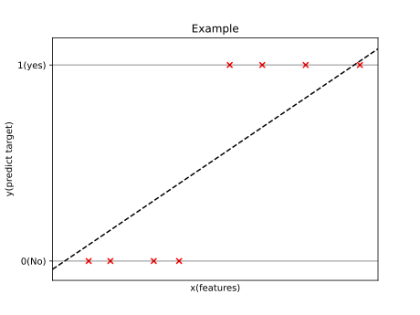
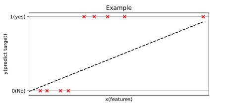
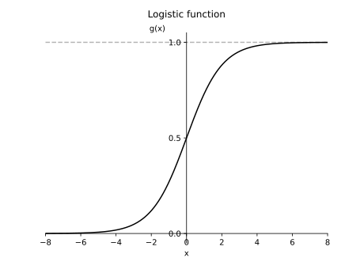
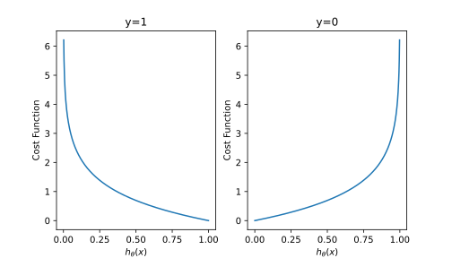
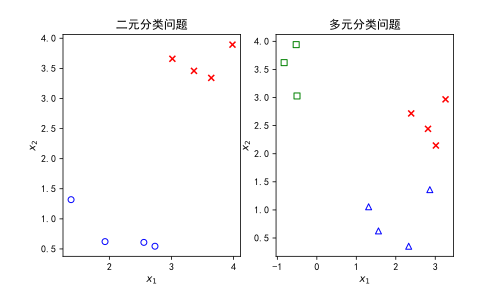
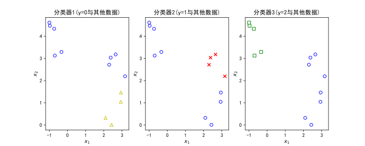

# 分类问题

这一节面对的当预测值是$y$离散值的学习问题，事实上离散值的估计非常常见，比如有正确识别垃圾邮件（是垃圾邮件/不是垃圾邮件）、交易是否存在欺诈（是/不是），肿瘤是良性或者恶性（良性/恶性）。本节将会开发一个__logistic回归算法__（一种广为流行的学习算法）来解决这类问题。

[toc]

## 问题分析

### 问题背景

上文的举例中，可以看到，我们要预测的变量$y$都是可以用两个值$0$或$1$表示出来的变量（即$y\in\{0,1\}$），这里我们也可以称$0$表示__负类__而相对的$1$为__正类__。这一类预测值只有$0$与$1$的分类问题是最简单的分类问题，我们将从这里出发解决并扩展解法到多分类问题的解决上。

### 分类算法的建立

#### 线性回归算法的套用

对于全新的学习问题，很自然的一个想法就是套用以前有的经验，比如我们假设下面这样一个训练集：

如图所示，可能可以得到图中虚线这样的拟合直线。以$0.5$为阙值，将直线大于$0.5$的区域视作预测值为$1$，对小于$0.5$的部分视作$0$。从图上来看我们似乎得到了还算可以的预测结果，但是这并不总是能奏效，比如我们假设上述训练集中多了一个样本，如下图：

按照同样的方法我们可以预测出一条拟合直线，但是此时不难发现，由于新样本的加入，许多原本应当为正类的结果被错误判断为了负类$0$。只从这个这个例子中，我们可以大概得出结论，线性回归并不适用于对离散变量预测问题的解决，事实上，往往只有你运气足够好的时候线性回归才适合离散量的预测问题。

应用线性回归的另一个问题是待预测离散量$y$的值总是非$0$即$1$的，对线性回归而言，有时候你可能甚至会得到$h_\theta(x)$大于$1$或小于$0$的时候。在下文中我们将会介绍logistic回归算法，它可以做到预测值始终保持在$0$到$1$之间。

#### logistic回归的构建

根据问题背景，我们所要的预测模型$h_\theta$应当对任意的特征输入$x$都有$h_\theta(x)\in[0,1]$成立。

对于线性回归，我们假设有$h_\theta(x)=\theta^Tx$。对于logistic回归，给出一种新的假设$h_\theta(x)=g(\theta^Tx)$，其中$g$定义为：
$$
g(z)=\frac{1}{1+e^{-z}}
$$
$g$也被称为__sigmoid函数__或者__logistic函数__，这也是logistic回归名字的由来。$g$绘图的函数图像如下：

可以看到，随着$x$趋近于$-\infty$，$g(x)$趋近于$0$；$x$趋近于$+\infty$，$g(x)$趋近于$1$；当$x=0$时恰好有$g(x)=0.5$。

于是我们的假设变成了$\displaystyle h_\theta(x)=\frac{1}{1+e^{-\theta^Tx}}$，先来看对logistic模型的解释：

> 对于任意的输入$x$，解释$h_\theta(x)$为对输入$x$时$y=1$的概率，比如下面这样一个例子：
>
> 假设某个肿瘤病人他的特征$x$有：
> $$
> x=\begin{bmatrix}x_0\\x_1\end{bmatrix}=\begin{bmatrix}1\\s(肿瘤大小)\end{bmatrix}
> $$
> 然后预测模型给出结果$h_\theta(x)=0.7$，那么假设可以告诉我们的是对于这个输入$x$预测值$y$有$70\%$几率为$1$（比如$y$预测恶性肿瘤，那么预测说明该病人有$70\%$几率是恶性肿瘤）。也就是说用概率学的写法有：
> $$
> h_\theta(x)=P(y=1|x;\theta)
> $$
> 即在$x$与$\theta$条件下$y=1$的几率。

__决策边界__是我们==假设函数==中的一个重要概念，同时在可视化中有重要作用。下面的例子将给出决策边界的意义解释：

>假设我们有这样一个训练集：
>
>
>
>其中$\times$表示$y=1$的点，$\circ$表示$y=0$的点。假设有$h_\theta(x)=\theta_0+\theta_1x_1+\theta_2x_2$，我们暂时忽略掉$\theta$是如何决策的，先给出一组数据$\displaystyle\theta=\begin{bmatrix}3\\1\\1\end{bmatrix}$，依据$h_\theta(x)=0.5$作出曲线，在图上我们可以看到，虚线分开了两个区域。其中在虚线上方，logistic回归模型预测$y=1$的概率超过$50\%$；虚线下方，模型预测$y=1$的几率小于$50\%$。根据$h_\theta(x)=0.5$所作出的区域边界即为__决策边界__，它是由给出模型所得到的一个特征（决策边界并不与训练集直接关联）。

## 代价函数

介绍完logistic回归模型的基本概念与原理之后，我们还需要了解如何选择参数$\theta$以完成我们学习模型的构建。

回归问题，假设我们已经拥有一个有$m$个样本的训练集：
$$
\{(x^{(1)},y^{(1)}),(x^{(2)},y^{(2)}),(x^{(3)},y^{(3)}),...,(x^{(m)},y^{(m)})\}
$$
其中每一个$x$都是$n+1$维的特征列向量$\displaystyle x=\begin{bmatrix}x_1\\x_2\\\vdots\\x_n\end{bmatrix}$，$x_0$始终为$1$，$y\in\{0,1\}$，假设函数$\displaystyle h_\theta(x)=\frac{1}{1+e^{-\theta^Tx}}$。

在过去解决线性回归问题时我们使用到了代价函数的概念来确定优化参数的目标，当时写法是：
$$
J(\theta)=\frac{1}{m}\sum_{i=1}^m\frac{1}{2}(h_\theta(x^{(i)})-y^{(i)})^2
$$
首先我们要做一些写法上的改变，考虑代价函数是$m$个项求和取平均（除以$m$）求和的结果，我们定义其中每一项为$\text{Cost}(h_\theta(x),y)$，对上面的线性回归的代价函数，即：
$$
\text{Cost}(h_\theta(x),y)=\frac{1}{2}(h_\theta(x)-y)^2
$$
于是我们可以简写代价函数$J$为：
$$
J(\theta)=\frac{1}{m}\sum_{i=1}^m\text{Cost}(h_\theta(x),y)
$$
这样写出的$\text{Cost}$能代表整体的代价函数，可以作为代价函数$J$的简写。

上文所述的代价函数$J$在线性回归问题中有良好的表现，但是到了logistic回归中，上述代价函数的函数图像会变成一个非凹函数，这导致它有多个局域最优解使得求解变得困难。我们需要找到一个新的性质更好的代价函数用于我们的迭代算法。

这里给出新的代价函数定义如下：
$$
\text{Cost}(h_\theta(x),y)=
\begin{cases}
-\ln(h_\theta(x))&\mathrm{if}\;y=1\\
-\ln(1-h_\theta(x))&\mathrm{if}\;y=0
\end{cases}
$$
或者$\text{Cost}(h_\theta(x),y)=-y\log(h_\theta(x))-(1-y)\log(1-h_\theta(x))$（这个写法与后文的梯度下降法有关）。我们从函数图像上来理解这个代价函数的意义：

下面给出在$y=1$或$y=0$时$\text{Cost}(h_\theta(x),y)$关于$h_\theta(x)$的图像：

可以看到，对上述给出的代价函数，$h_\theta(x)$在接近对应$y$值时代价函数会逐渐到达$0$，当$h_\theta(x)$偏向远离对应$y$值时，代价函数数值会迅速膨胀，最终趋于正无穷，它表示我们在这种情况下要给出$y$等于另一个值的代价随预测概率的下降而大幅提高。

## 代价函数的简化与梯度下降实现

根据上文的代价函数介绍，我们可以构建logistic模型的代价函数$J$如下：
$$
J(\theta)=-\frac{1}{m}\left[\sum_{i=1}^my^{(i)}\ln(h_\theta(x^{(i)}))+(1-y^{(i)})\ln(1-h_\theta(x^{(i)}))\right]
$$
（这个代价函数在前面并没有说明出处，它实际上来自于概率统计的极大似然估计法，不妨想想为什么）

最小化代价函数的方法可以选用梯度下降法，即重复步骤：
$$
\begin{align}
\theta_j:=\theta_j-\alpha\frac{\partial}{\partial\theta_j}J&&(\forall j\in[0,n])
\end{align}
$$
具体到分类问题的计算，我们可以得到：
$$
\begin{align}
\frac{\partial}{\partial\theta_j}J&=-\frac{1}{m}\sum_{i=1}^mx_j^{(i)}(y^{(i)}-h_\theta(x_j^{(i)}))\\
&=\frac{1}{m}\sum_{i=1}^mx_j^{(i)}(h_\theta(x_j^{(i)})-y^{(i)})
\end{align}
$$
即：
$$
\begin{align}
\theta_j:=\theta_j-\frac{\alpha}{m}\sum_{i=1}^mx_j^{(i)}(h_\theta(x_j^{(i)})-y^{(i)})&&(\forall j\in[0,n])
\end{align}
$$
（和线性回归的梯度下降迭代过程统一了）

## 高级优化

除去梯度下降法之外，我们也有一些别的方法来达成我们的优化目标，比如：

* 共轭梯度法
* BFGS算法
* L-BFGS算法

这些高级算法相对而言更加复杂，也需要花费更长时间去学习（详细内容可以寻找高等数值计算相关的书籍）。不过相较梯度下降法，上面的算法也有自己的一些优点，比如：

* 不需要手动选择学习率$\alpha$。
  >算法内部存在一个智能的内部循环称为线搜索算法，实现自动选择一个足够好的学习率，甚至可以为每一次迭代过程选取不同想学习率。

* 它们往往比起梯度下降法有更快的收敛速度。

这些算法内容相对而言都会比较复杂，也不建议自行编写函数去完成算法的实现，更推荐使用编写好的函数库来实现它们。（似乎`scipy`库有实现它们的算法，可以试着在网上搜索一下相关资料）

## 多分类问题的扩展

从例子出发来认识多分类问题：

假如我们现在需要一个学习算法来对我们邮箱内的邮件分类，分到四个种类中：

> * 工作$(y=0)$
> * 生活$(y=1)$
> * 家庭$(y=2)$
> * 娱乐$(y=3)$

像这样，预测值$y$可以取很多值的分类问题就称为__多分类问题__。

相较于二元分类问题，多元分类问题的训练集往往不止一种符号，这种差别可以在下面的图例中看出：

对于多元分类问题，我们通常采用这样的解决方法：

假设我们已经有了一个训练集，它绘图效果如下：

其中$y\in\{0,1,2\}$，对每一个$y$值，我们考虑定义一个伪训练集将它与其他$y$值数据区分开来，如下图：

像这样，每一个分类器（第$i$个）中我们都可以得到做一次logistic回归得到一个预测函数$h_\theta^{(i)}(x)$，对于这个多元分类问题，最终对任意输入$x$，预测结果$h_\theta(x)$依据如下原则判定：计算全体$h_\theta^{(i)}(x)$，其中找到最大值那个分类器对应的$y$值，该$y$值即为预测结果。由此，我们得到了多元分类问题模型的学习方法。

