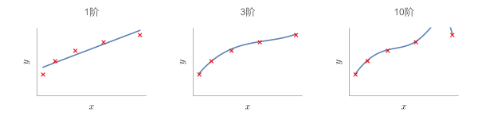

# 过拟合与正则化

在之前的章节中我们已经学习了线性回归与逻辑回归两种模型，这一节我们将会讨论在之前所没有涉及的过拟合问题，然后引入正则化方法来解决过拟合现象。

[toc]

## 过拟合现象

对于线性回归问题，同样的训练集我们可以选择不同阶数的模型来进行拟合求解。我们知道，当选取阶数越高时，模型对训练集的拟合效果必然会越好，但是对训练集过分优秀的拟合也并非绝对的好事，以下图为例：

如图所示，假如红叉代表了原始训练集，当模型阶数取$1$时可以看到其实拟合效果相对较差；模型阶数取$3$时我们获得了一个比较良好的拟合效果；但是当模型阶数取$10$时模型的曲线显然出现了一点问题，只从曲线上来看它确实通过了所有的数据点，完美符合了训练集，但是它却有一段不自然的凸起，这和我们所理想的模型相差甚远。这种问题称为__过度拟合__，也可以简称为__过拟合__问题（另一种说法是这个模型具有高方差，不过这是一种历史遗留的说法了），而模型拟合效果不佳的情况我们称之为__欠拟合__。关于过拟合，一种直观的说法就是，当我们没有足够多的数据来约束模型时，就可能发生过拟合的现象。过拟合现象不止发生在线性回归，在逻辑回归中也可能出现。过拟合会导致模型缺乏对广泛数据的预测能力，只有在训练集上拥有较好的预测效果，因此，如何避免过拟合问题也是我们需要实现的目标。

对过拟合问题问题，首先可以想到的解决方法就是可视化，比如像上面的，通过绘图直接判断取合适多项式的阶数。但这样的方法只能适用于很小的特征数目，一旦特征数目增多，可视化就不再是一个可选的选项。

一般来说，对于过拟合问题，我们有两种解决方法：

1. 减少变量数目

   * 人工检查变量清单来确定哪些变量是值得保留的，哪些是应该舍弃的。
   * 通过__模型选择算法__来确定该选择哪些特征变量（在这节后面内容）

   （减少特征变量也就意味着丢失了信息，有些时候我们并不希望发生这种情况）

2. __正则化__

   * 保留特征变量，但是减少参数$\theta_j$的量级（或大小）

## 正则化原理

回到我们的回归计算，我们知道线性回归和逻辑回归的优化目标都是：
$$
\min_{\theta}\frac{1}{2m}\sum_{i=1}^m(h_\theta(x^{(i)})-y^{(i)})^2
$$
即寻找$\theta$的最佳参数组来最小化代价函数，我们不妨假设原预测函数为$h_\theta(x)=\theta_0+\theta_1x+\theta_2x^2+\theta_3x^3+\theta_4x^4$时出现了过拟合现象，我们可以将优化目标变成：
$$
\min_{\theta}\left(\frac{1}{2m}\sum_{i=1}^m(h_\theta(x^{(i)})-y^{(i)})^2+1000(\theta_3)^2+1000(\theta_4)^2\right)
$$
这样，对于高阶项的$\theta_3$与$\theta_4$由于惩罚项的引入从而使得它们在优化结果中必然非常小（这里惩罚项没有特别的意义，只是展示下这样的操作），于是最终目标函数的优化结果就会成为一个二次函数加上两个修正的小量。这也正是正则化的基础思想，通过引入惩罚项来简化目标函数，使得模型变得更加平滑，简单，也更不容易出现过拟合问题。

综上所述，我们在正则化中所需要做的，就是去通过添加惩罚项来缩小所有参数的值，所以我们的代价函数可以写成像这样：
$$
J(\theta)=\frac{1}{2m}\left[\sum_{i=1}^m(h_\theta(x^{(i)})-y^{(i)})^2+\lambda\sum_{j=1}^m{\theta_j}^2\right]
$$
我们称$\displaystyle\lambda\sum_{j=1}^m{\theta_j}^2$为__正则化项__，$\lambda$称为__正则化参数__。正则化项从$1$开始求和，也是一种约定俗称，即不对$\theta_0$进行惩罚。对于这个代价函数的解释，其第一项的目的在于尽量的拟合我们的训练集，第二项的目标则是尽量控制各个参数的大小，来控制模型相对简单，正则化参数$\lambda$用来控制两个目标的取舍关系。从直觉上可能很难理解正则化是如何起到避免过拟合的效果的，不妨亲自动手尝试一下就能看到正则化操作的效果。

需要注意的是，正则化也并非无止境的进行惩罚操作，如果$\lambda$过大，这相当于对所有参数进行惩罚，会导致结果中除$\theta_0$以外的参数过小，出现欠拟合的现象。在之后的学习中，我们也将介绍一些方法来自动的选择正则化参数的方法。

## 线性回归的正则化

在线性回归中我们学过两种优化方法，即梯度下降法与正规方程求解，我们分别介绍它们做正则化后的修改：

### 梯度下降法

我们知道原本的梯度下降法迭代操作为：
$$
\theta_j:=\theta_j-\alpha\frac{1}{m}\sum_{i=1}^m(h_\theta(x^{(i)})-y^{(i)})x^{(i)}_j
$$

引入正则化之后迭代操作变为（事实上原理没变，对新代价函数求下导就能得到）：
$$
\begin{align}
&\theta_j:=\theta_j-\alpha\frac{1}{m}\left[\sum_{i=1}^m(h_\theta(x^{(i)})-y^{(i)})x^{(i)}_j-\lambda\theta_j\right]\\
\iff&\theta_j:=\theta_j(1-\alpha\frac{\lambda}{m})-\alpha\frac{1}{m}\sum_{i=1}^m(h_\theta(x^{(i)})-y^{(i)})x^{(i)}_j
\end{align}
$$
这两种写法是等价的。

注意这个$\displaystyle(1-\alpha\frac{\lambda}{m})$，这个项通常是一个比$1$略小的数，所以你可以通过这个项来大致体会一下正则化参数的作用，即在每次梯度下降之前先略微"削弱"一点$\theta_j$的值，当然这只是直观的理解，但是却有助于我们理解正则化的原理。

### 正规方程

在之前的章节我们介绍了正规方程求解来直接获得参数向量$\theta$，即求：
$$
\theta=(X^TX)^{-1}X^Ty
$$
为方便理解，简单介绍一下正规方程的原理：即求解
$$
\frac{\part}{\part \theta_j}J(\theta)=0\:(\forall j\in\mathbb N)
$$
最终可以根据线性代数相关知识得到正规方程。

我们跳过数学推导，直接给出结论，当使用正则化之后，正规方程应该改写为：
$$
\theta=(X^TX+\lambda M)^{-1}X^Ty
$$
其中$\displaystyle M^{(n+1)\times (n+1)}=\begin{bmatrix}0&&&&\\&1&&&\\&&1&&\\&&&\ddots&\\&&&&1\end{bmatrix}$，$n+1$是特征变量的个数（包括$\theta_0$）。

（正则化的另一个好处就是$X^TX+\lambda M$绝对是可逆的，因此我们也无需为了一些小问题而担忧）

## 逻辑回归的正则化

在逻辑回归中我们学过一种优化方法，即梯度下降法。下面介绍它们做正则化后的修改：

### 梯度下降法

原理式和线性回归那里是一样的，我们只需要代入逻辑回归的代价函数自然就可以得到下面的迭代式：
$$
\begin{align}
&\theta_j:=\theta_j-\alpha\frac{1}{m}\left[\sum_{i=1}^m(h_\theta(x^{(i)})-y^{(i)})x^{(i)}_j-\lambda\theta_j\right]\\
\iff&\theta_j:=\theta_j(1-\alpha\frac{\lambda}{m})-\alpha\frac{1}{m}\sum_{i=1}^m(h_\theta(x^{(i)})-y^{(i)})x^{(i)}_j
\end{align}
$$

之前曾提到过的高级优化算法则需要自己根据原理去修改计算式，不过事实上原理也并不复杂，即代价函数$J$更改后重新代入不同种算法而已。
